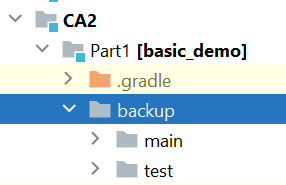
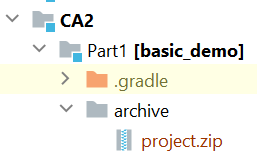

CA2: Part1 README
==============

The Readme is structure in 6 sections:

- **CA2 Part 1 Steps** : this section works like a step-by-step tutorial of the process followed in this CA(further details on the implementation can be found in the implementation section);
- **Tutorial for Chat room server**: original tutorial included in the project.

CA2 Steps
=====

**1.1** Downloaded and added basic_demo application to repository;
___
**2.1** Followed basic_demo application's readme, to verify the application could be run propperly;
(you can find the original readme at the bottom of this file)
___
**3.1** Added task to execute the server automatically through gradle, onto the build.gradle file:
```
   task runServer(type:JavaExec, dependsOn: classes) {
    group = "DevOps"
    description = "Executes the Server(port 59001) so the chat room can be used by the client"

    classpath = sourceSets.main.runtimeClasspath

    main = 'basic_demo.ChatServer'

    args '59001'
}
```
___
**3.2** Ran gradle build:
```
./gradlew build 
```
___
**3.3** Ran task runServer on terminal:

```
./gradlew runServer
```


___
**3.4** Ran task runClient on another terminal window to ensure that everything was still working as intended:
```
./gradlew runClient
```


___

**4.1** Added junit 4.12 dependency to build.gradle:

```
dependencies {
    //Use junit 4.12 for testing
    // https://mvnrepository.com/artifact/junit/junit
    testImplementation group: 'junit', name: 'junit', version: '4.12'
}
```
___
**4.2** Added class AppTest.java to src/test/java/basic_demo folder as the path to the test classes need to reflect the path of the application class;
___
**4.3** Tried to build the project to confirm everything was still correctly setup:
```
./gradlew build
```
___
**4.4** Successfully ran unit tests using gradle command:
```
./gradlew clean test --scan
```

___
**5.1** Added task copyProject to execute a backup of the sources folder:
```
task copyProject(type: Copy) {
    from 'src'
    into 'backup'
}
```
___
**5.2** Ran gradle build:
```
./gradlew build 
```
___
**5.3** Ran the copyProject task:
```
./gradlew copyProject 
```


___
**5.4** Verified that the backup was created in the Part1 folder:


___
**6.1.1** Added task archiveProject to execute an archive of the sources folder into a zip file:
```
task archiveProject(type: Zip) {
    archiveFileName = "project.zip"
    destinationDirectory = layout.buildDirectory.dir('archive')

    from 'src'
}
```
This creates the zip file inside the build folder.
___
**6.1.2** Alternatively I wanted to test if I could create the file in a separate folder (similar to the solution in the backup task):
```
task archiveProject(type: Zip) {
    archiveFileName = "project.zip"
    destinationDirectory = file("archive")

    from 'src'
}
```
This creates the zip file inside an archive folder, on the same level as the src folder. 

For the purpose of this assignement this folder was added to the repository and both alternatives are present in the build.gradle file (the previous one is commented as to not affect the build);
___
**6.2** Ran gradle build:
```
./gradlew build 
```
___
**6.3** Ran the archiveProject task:
```
./gradlew archiveProject 
```


___
**6.4** Verified that the zip file was created in the folder:

*file created in build/archive folder*


OR

*file created in archive folder*

___
**7.1** Added new files, commited changes, created "ca2-part1" tag and pushed contents to repository;

___
Tutorial for Chat room server
===================
Gradle Basic Demo
===================

This is a demo application that implements a basic multithreaded chat room server.

The server supports several simultaneous clients through multithreading. When a client connects the server requests a screen name, and keeps requesting a name until a unique one is received. After a client submits a unique name, the server acknowledges it. Then all messages from that client will be broadcast to all other clients that have submitted a unique screen name. A simple "chat protocol" is used for managing a user's registration/leaving and message broadcast.


Prerequisites
-------------

 * Java JDK 8
 * Apache Log4J 2
 * Gradle 6.6 (if you do not use the gradle wrapper in the project)
   

Build
-----

To build a .jar file with the application:

    % ./gradlew build 

Run the server
--------------

Open a terminal and execute the following command from the project's root directory:

    % java -cp build/libs/basic_demo-0.1.0.jar basic_demo.ChatServerApp <server port>

Substitute \<server port> by a valid port number, e.g. 59001

Run a client
------------

Open another terminal and execute the following gradle task from the project's root directory:

    % ./gradlew runClient

The above task assumes the chat server's IP is "localhost" and its port is "59001". If you whish to use other parameters please edit the runClient task in the "build.gradle" file in the project's root directory.

To run several clients, you just need to open more terminals and repeat the invocation of the runClient gradle task