CA2: Part2 README
==============

The Readme is structure in 1 section:

- **CA2 Part 2 Steps**: this section works like a step-by-step tutorial of the process followed in this CA;

CA2 Steps
=====

**1. Create "tut-basic-gradle" branch:**

```
git checkout -b "tut-basic-gradle"
```
___
**2. Setup new gradle project:**

- **2.1** Start new gradle project in https://start.spring.io/:

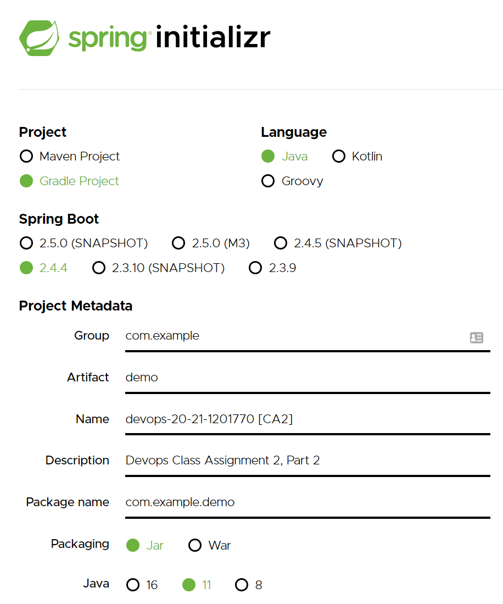

- **2.2** Include the following dependencies:

    - Rest Repositories;
    - Thymeleaf; 
    - JPA; 
    - H2.
    
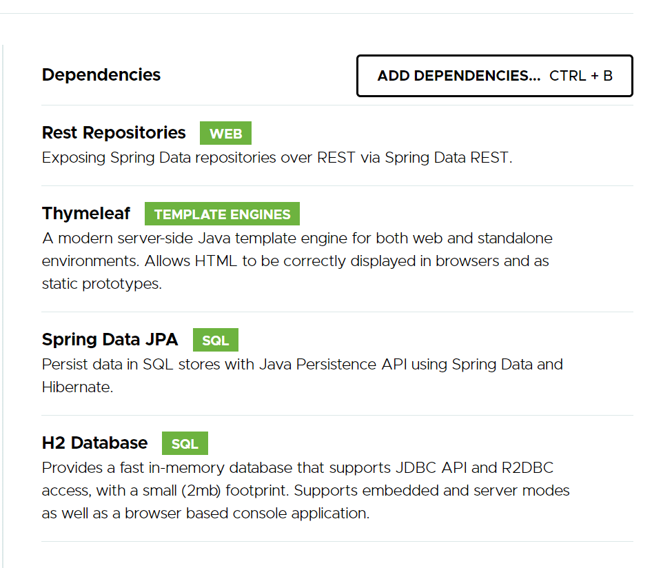

- **2.3** Extract zip file into CA2/Part2 directory in repository;

- **2.4** Run ```./gradlew build``` and ```./gradlew tasks```:

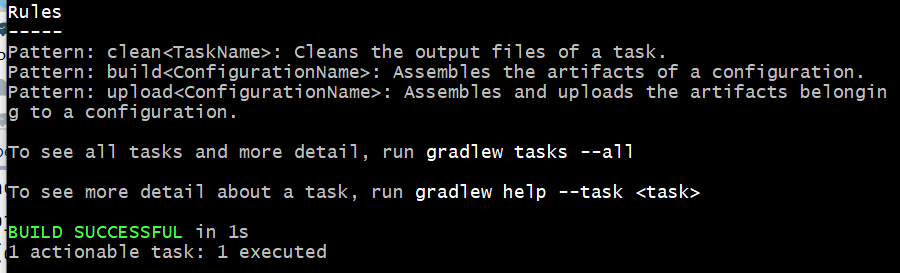

**3. Copy CA1 src folder into CA2/Part2/src:**

**3.1** Delete current src folder:

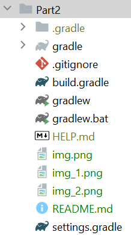

**3.2.** Copy src folder from CA1:

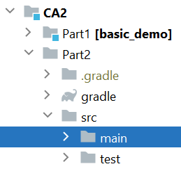

**3.3** Delete src/main/resources/static/built/ as this is generated from js by webpack tool:

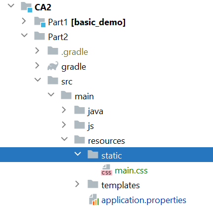
___
**4. Setup frontend**
**4.1** Build the project and run ```./gradlew bootRun```;

**4.2** Verify that ```localhost:8080``` is empty:

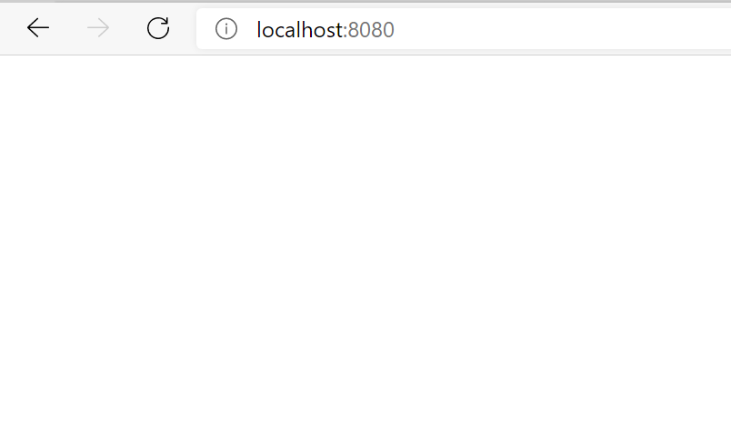

**4.3** Add gradle plugin "org.siouan.frontend" to the project:

- add the following line to the plugins block in build.gradle:
  
```id "org.siouan.frontend" version "1.4.1"```
- add the following block to build.gradle to configure the plugin:

```
frontend {
nodeVersion = "12.13.1"
assembleScript = "run webpack"
}
```
- Copy the packgage.json and webpack.config.js from tut-basic:
  
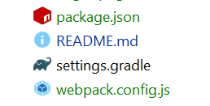

- Update the scripts section/object in package.json to configure the execution of webpack:
```
  "webpack": "webpack"
```

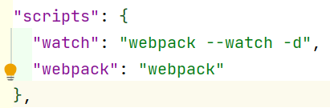

**4.4** Execute ```./gradlew build```and run spring by executing ```./gradlew bootRun```.

**4.5** Access localhost:8080 and check if frontend is available:

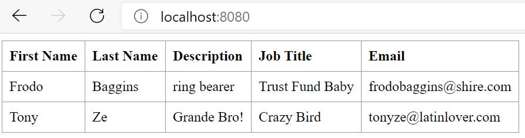
___
**5. Add task to copy the generated jar:**

**5.1** Add task to gradle.build:

```
task copyGeneratedJar(type: Copy) {
	from 'build/libs/demo-0.0.1-SNAPSHOT.jar'
	into 'dist'
}
```
**5.2** Build the project and run the new command:
```
./gradlew copyGeneratedJar
```
**5.3** Verify if file was copied to proper location:

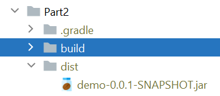
___
**6. Add task to delete the files generated by the webpack**

**6.1** Add task ```deleteWebPack``` and ```clean``` to gradle.build:
```
task deleteWebPack(type: delete) {
	delete 'src/main/resources/static/built/'
}

clean {
	dependsOn 'deleteWebPack'
}

```
**6.2** Build the project and run the deleteWebPack:
```
./gradlew deleteWebPack
```